# Freedom Planet 2 Sonic Mod

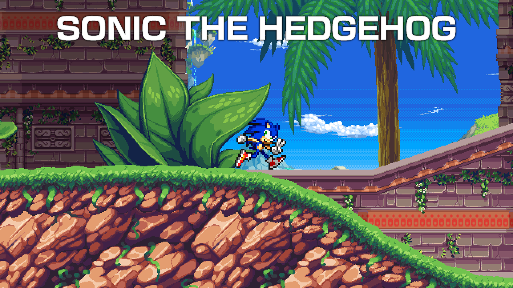

A mod for Freedom Planet 2 (using [FP2Lib](https://github.com/Kuborros/FP2Lib)) that adds Sonic The Hedgehog as a playable character.

### Features

- Own character slot. No replacing existing characters.

- Completely custom moveset.

- Minor stage modifications to accommodate Sonic's moves.

- Customisable voice and jump sound.

- Eight new achievement badges.

- Ten new vinyls.

- And maybe a tiny litle extra something upon full game completion...?

## Moveset

**Double Jump**

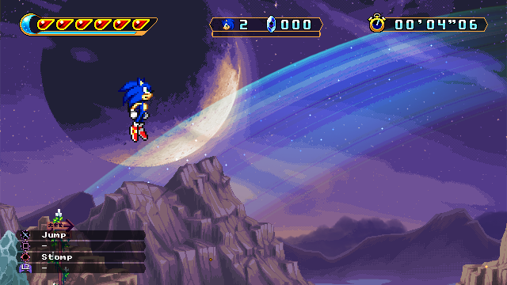

Press the jump button while airborne to perform a Double Jump.

**Spin Dash**

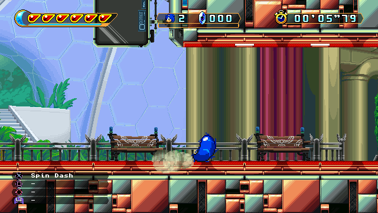

While on the ground, hold down and press the jump button to begin charging a Spin Dash. Repeatedly tap the button to increase the power of the Spin Dash, then release down to blast off at high speed.

**Air Dash**

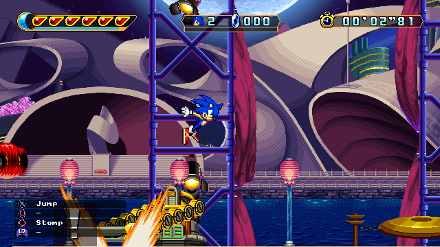

While in the air from a spin jump, double tap either left or right to Air Dash in that direction.

**Homing Attack**

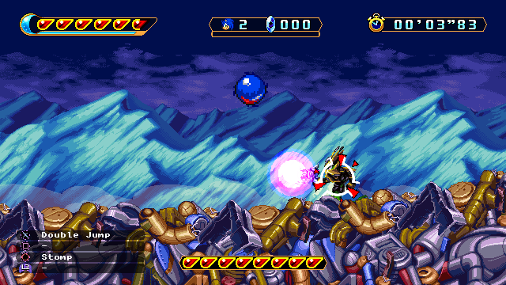

While airborne, a lock-on cursor will appear on the closest enemy. Press the attack button to launch a Homing Attack which zeroes in on the enemy's position.

**Stomp**

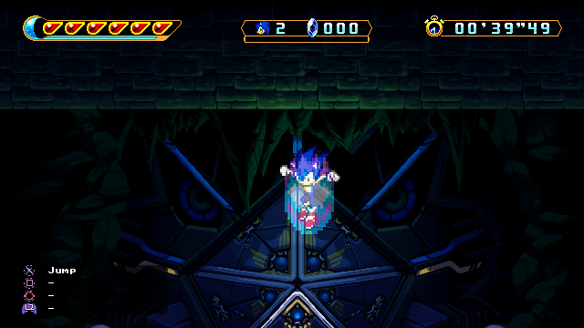

While airborne, press the special button to perform a Stomp. Useful if you need to get back to the ground quick or are above an enemy but not in a ball. 

**Hop Jump**

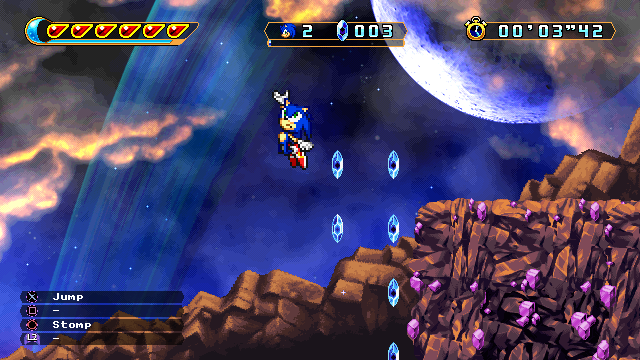

While bouncing off a spring, hold up and press the attack button to perform a Hop Jump for a bit of extra height.

**Humming Top**

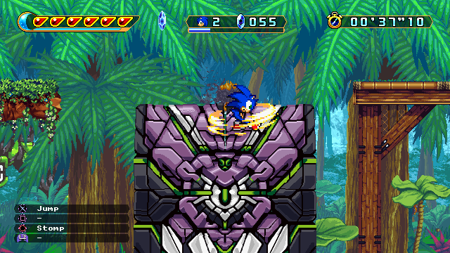

While bouncing off a spring, hold left or right and press the attack button to fire a Humming Top for a quick burst of speed.

**Rocket Wisp**

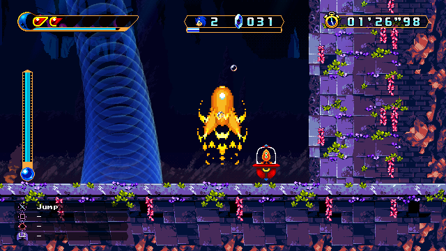

After collecting a Wisp Capsule, press the guard button to activate the Rocket Wisp. This will launch you up into the air for as long as energy remains in the energy gauge.

**Super Sonic**

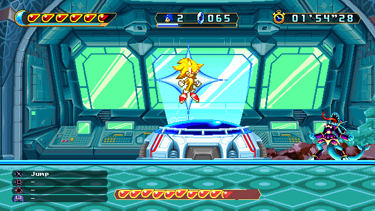

After acquiring and equipping a certain item, collect fifty crystal shards then jump and press the guard button to transform into Super Sonic. In this form, Sonic is invincibile, twice as fast and has an active hitbox at all times. A crystal shard will be lost every second, and running out will cause Sonic to transform back to normal.

## Building

First off, ensure that your system has [Visual Studio 2022](https://visualstudio.microsoft.com/) installed alongside the `.NET Framework 3.5 development tools`, as well as [Unity 5.6.3](https://unity.com/releases/editor/whats-new/5.6.3#installs) and [FP2Lib](https://github.com/Kuborros/FP2Lib) (at least Version 0.3. The [Freedom Manager](https://github.com/Kuborros/FreedomManager) program should install this automatically if used.).

Open the solution file in VS2022 then go to `Tools > Options` and select `Package Sources` under the `NuGet Package Manager` category. Then add a package source called `BepInEx` with the source url set to `https://nuget.bepinex.dev/v3/index.json`.

Next, go to the `Assemblies` category in the `Dependencies` for the project, then delete the `Assembly-CSharp` and `FP2Lib` references. Right click on the Assemblies category and click `Add Assembly Reference...`, then click `Browse...` and navigate to Freedom Planet 2's install directory. Open the `FP2_Data` directory, then the `Managed` directory and select the `Assembly-CSharp.dll` file. Click Add, then Browse again and navigate to the location that FP2Lib's DLL is installed to (likely `BepInEx\Plugins\lib`) and select the `FP2Lib.dll` file. Click Add, then click OK.

You should now be able to right click the solution and choose `Rebuild` to build the mod. Though it is recommended to change the build configuration from `Debug` to `Release`, as the debug build prints a lot of console messages that are useless to the average player.

## Installing

Navigate to `BepInEx/plugins` and create a new folder with whatever name you want. Then copy the `FP2_Sonic_Mod.dll` file from the build (`bin/Debug/net35` or `bin/Release/net35`) into it. If using Freedom Manager, you may also want to copy the included `modinfo.json` file to give the mod a proper entry in the manager, although this is not strictly required.

## Customisation

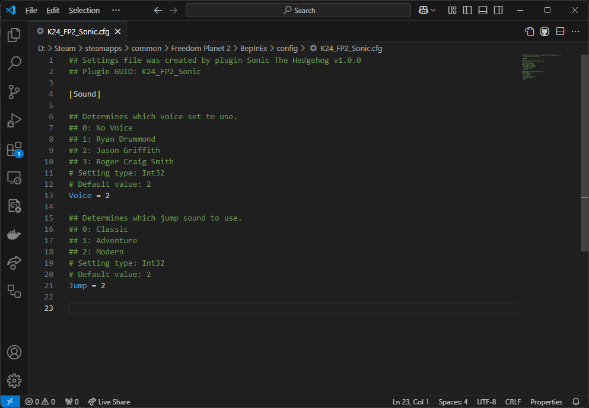

This mod has two customisable options (those being Sonic's voice and jump sound effect). To customise these, go to the `BepInEx/config` and open `K24_FP2_Sonic.cfg` in a text editor. What value corresponds to what is listed within the configuration file itself.

## Asset Credits

Sonic Sprites - Sonic Advance 1, 2, 3 and Battle, ripped by [AshuraMoon](https://www.spriters-resource.com/game_boy_advance/sonicadv/sheet/6583/), [Ice](https://www.spriters-resource.com/game_boy_advance/sonicadv2/sheet/154243/), [Ren "Foxx" Ramos](https://www.spriters-resource.com/game_boy_advance/sonicadv3/sheet/7143/) and [QuadFactor](https://www.spriters-resource.com/game_boy_advance/sonicbattle/sheet/10039/).

Bakunawa Chase Tornado Sprites - Sonic Advance, ripped by [Daniel Sidney](https://www.spriters-resource.com/game_boy_advance/sonicadv/sheet/7090/).

Custom Super Sonic Sprites - Ripped by Kevin Huff, edited by [Moe](https://www.spriters-resource.com/custom_edited/sonicthehedgehogcustoms/sheet/113731/).

Character Select Portrait - Sonic Advance 3, ripped by [HXC](https://www.spriters-resource.com/game_boy_advance/sonicadv3/sheet/7151/).

File Icon - Sonic Advance 3, ripped by [EternalLight](https://www.spriters-resource.com/game_boy_advance/sonicadv3/sheet/7156/).

Life Icon - Sonic Advance, ripped by [EternalLight](https://www.spriters-resource.com/game_boy_advance/sonicadv/sheet/6600/).

Power Sneakers Icon - Sonic Advance, ripped by [Spitfya](https://www.spriters-resource.com/game_boy_advance/sonicadv/sheet/234248/).

Rocket Wisp Capsule - Sonic Colours DS, ripped by [Trish Rowdy](https://www.spriters-resource.com/ds_dsi/soniccolors/sheet/35327/).

Rocket Wisp - Sonic Colours DS, screencapped and edited by [HogeezHoagies](https://www.youtube.com/@HogeezHoagies).

Homing Attack Cursor - Sonic 4 Episode 2, ripped by [thegameexplorer](https://www.textures-resource.com/pc_computer/sonic4ep2/texture/3865/).

Tutorial Tiles - Sonic Advance 3, ripped by [Techokami](https://www.spriters-resource.com/game_boy_advance/sonicadv3/sheet/25411/).